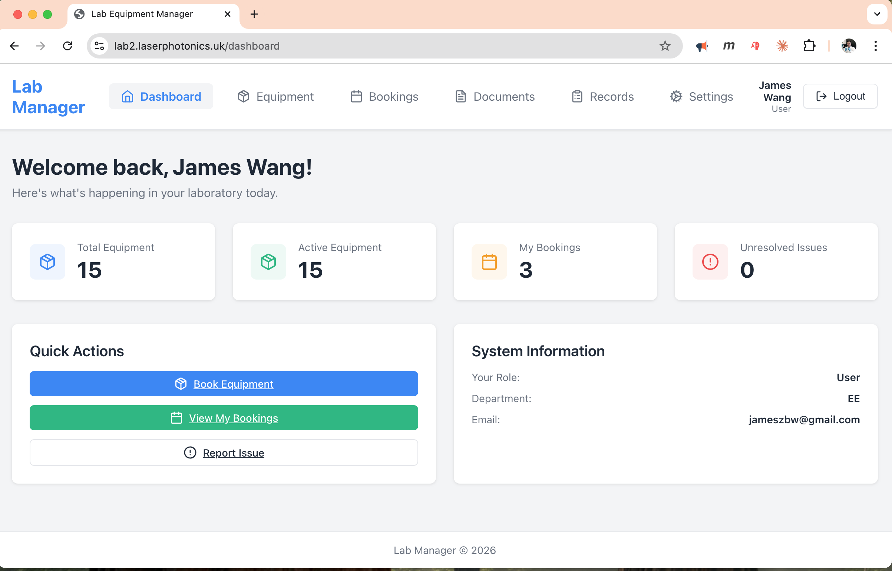

# Lab Equipment Management System

A full-stack Node.js and React application for managing laboratory equipment, bookings, and maintenance.

## Preview



### Features & Interface
*   [**Equipment Management**](./assets/screenshots/Equipment.png) - Track and manage lab inventory.
*   [**Booking System**](./assets/screenshots/Bookings.png) - Schedule and reserve equipment.
*   [**Document Library**](./assets/screenshots/Documents.png) - Store and access manuals and safety records.
*   [**Activity Logs**](./assets/screenshots/Records.png) - View maintenance and usage history.

## OS Compatibility & Deployment

This version has been enhanced to support **both Linux and macOS** environments.

### Key Fixes for macOS Deployment:
*   **Portable Configuration:** Updated `.env` loading to use absolute paths (`path.join`), ensuring the backend can find its configuration regardless of the working directory.
*   **Database Portability:** Explicitly mapped database connection parameters to environment variables, fixing issues where macOS would default to the system username for database connections.
*   **Cross-Platform Authentication:** Switched to `bcryptjs` for password hashing, ensuring credentials remain compatible when migrating databases between Linux and macOS.
*   **Nginx/macOS Permissions:** Optimized for macOS-specific directory permission requirements.

## Deployment Options

### 1. Docker Deployment (Recommended for Demos)

The easiest way to run the entire stack (Frontend, Backend, and Database) is using Docker Compose.

**To start the application:**
```bash
docker compose up --build -d
```

**Access the application:**
*   **Frontend:** `http://localhost:8080`
*   **Backend API:** `http://localhost:5001/api/health`

**Initial Setup (inside Docker):**
The first time you run it, you'll need to run migrations:
```bash
docker exec labmanager-backend npm run db:migrate
```

**Demo Credentials:**
*   **Email:** `admin@lab.com`
*   **Password:** `admin123`

---

### 2. Manual Local Setup (macOS)

1.  **Clone the repository**
2.  **Database Setup:**
    ```bash
    brew install postgresql@14
    brew services start postgresql@14
    createdb lab_manager
    ```
3.  **Environment Configuration:**
    Create a `.env` file in the `backend/` directory based on `.env.example`.
4.  **Install & Build:**
    ```bash
    cd backend && npm install && npm run build
    cd ../frontend && npm install && npm run build
    ```
5.  **Run with PM2:**
    ```bash
    pm2 start backend/dist/server.js --name labmanager
    ```

## Original Linux Deployment
The original version was designed for a Linux VPS (`/var/www/` structure). This version remains fully compatible with that setup while providing improved stability for Mac developers and instant demo capability via Docker.
